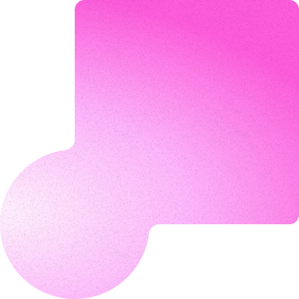
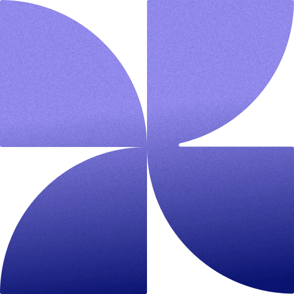
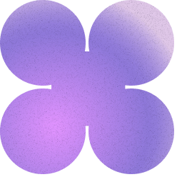

   

# GenesisPixel Demos

>Interactive demo platform inspired by the cards on the Genesis Pixel main page.


## About this project

GenesisPixel | Demos is a collection of visual and interactive chapters that explore different CSS and frontend development techniques. Each chapter is inspired by the cards on the [Genesis Pixel](https://genesis-pixel.vercel.app/) main page, allowing users to dive deeper into each concept with practical examples and unique visual effects.

---

## Main website

To see the full version of Genesis Pixel, visit:

**[https://genesis-pixel.vercel.app/](https://genesis-pixel.vercel.app/)**

---

## Chapters

| # | Chapter | Level |
|---|---------|-------|
| 1 | Transitions | Beginner |
| 2 | Transform | Intermediate |
| 3 | Keyframes | Advanced |
| 4 | Interactions | Expert |
| 5 | Three.js | 3D |
| 6 | Shaders | Advanced |

---

## Technologies used

- **HTML5** - Semantic and accessible structure
- **CSS3** - Grid, Flexbox, and Custom Properties for flexible layouts
- **Afronaut Font** - Custom typography for headings
- **SVG** - Vector icons and gooey effects using filters

---

## Key features

- Custom navbar with star icon and navigation lines
- Goo SVG effect with unique fusion filters per chapter
- 3-column grid layout with dividers to separate content
- Chapter navigation with colored circular buttons
- 11 SVG images per chapter with different compositions
- Custom colors per chapter defined with CSS Variables
- Smooth transitions across all interactions

---

## Project structure

```
genesis-pixel-demos/
├── index.html          # Main page
├── chapter1.html       # Transitions
├── chapter2.html       # Transform
├── chapter3.html       # Keyframes
├── chapter4.html       # Interactions
├── chapter5.html       # Three.js
├── chapter6.html       # Shaders
├── css/
│   └── base.css        # Main styles
├── img/
│   ├── preview.jpg     # Project preview image
│   ├── favicon.png     # Site icon
│   ├── stars.svg       # Navbar icon
│   └── svg-*.png       # Chapter images
└── README.md
```

---

## How to run

1. Clone the repository
2. Open the `index.html` file in a web browser
3. Navigate between chapters using the circular buttons in the bottom right corner
4. Explore the different visual effects in each chapter

---

## Color palette

| Color | Code | Usage |
|-------|------|-------|
| Beige | `hsla(36, 31%, 90%, 1)` | Main background |
| Dark green | `hsla(158, 23%, 18%, 1)` | Text and navbar |
| Purple | `rgb(205, 148, 235)` | Chapter 1 - Transitions |
| Green | `rgb(174, 226, 205)` | Chapter 2 - Transform |
| Orange | `rgb(227, 188, 155)` | Chapter 3 - Keyframes |
| Blue | `rgb(188, 225, 251)` | Chapter 4 - Interactions |
| Pink | `#FF96F9` | Chapter 5 - Three.js |
| Yellow | `#FFC555` | Chapter 6 - Shaders |


##

Part of Genesis Pixel - [https://genesis-pixel.vercel.app/](https://genesis-pixel.vercel.app/)


#
<div align="center">❤️ Hecho con amor por Sebastián V.</div>
