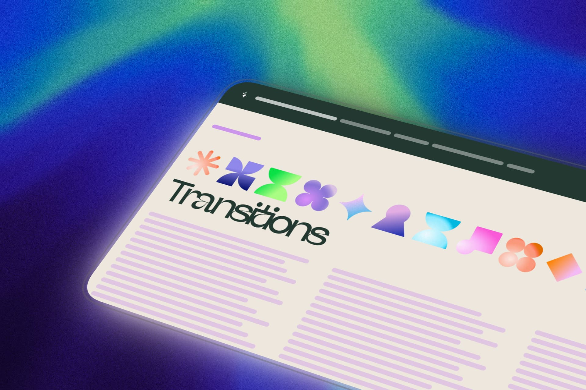

# GenesisPixel | Demos



> Plataforma de demos interactivas derivadas de las cards de la pagina principal de Genesis Pixel.

---

## Sobre este proyecto

GenesisPixel | Demos es una coleccion de capitulos visuales e interactivos que exploran diferentes tecnicas de CSS y desarrollo frontend. Cada capitulo esta inspirado en las cards de la pagina principal de [Genesis Pixel](https://genesis-pixel.vercel.app/), permitiendo al usuario profundizar en cada concepto con ejemplos practicos y efectos visuales unicos.

---

## Pagina principal

Para ver la version completa de Genesis Pixel, visita:

**[https://genesis-pixel.vercel.app/](https://genesis-pixel.vercel.app/)**

---

## Capitulos

| # | Capitulo | Nivel |
|---|----------|-------|
| 1 | Transitions | Principiante |
| 2 | Transform | Intermedio |
| 3 | Keyframes | Avanzado |
| 4 | Interacciones | Experto |
| 5 | Three.js | 3D |
| 6 | Shaders | Avanzado |

---

## Tecnologias utilizadas

- **HTML5** - Estructura semantica y accesible
- **CSS3** - Grid, Flexbox y Custom Properties para layouts flexibles
- **Afronaut Font** - Tipografia personalizada para titulos
- **SVG** - Iconos vectoriales y efectos gooey mediante filtros

---

## Caracteristicas principales

- Navbar personalizada con icono de estrellas y lineas de navegacion
- Efecto Goo SVG con filtros de fusion unicos por capitulo
- Grid de 3 columnas con divisores para separar contenido
- Navegacion entre capitulos con botones circulares de colores
- 11 imagenes SVG por capitulo con diferentes composiciones
- Colores personalizados por capitulo definidos con CSS Variables
- Transiciones suaves en todas las interacciones

---

## Estructura del proyecto

```
genesis-pixel-demos/
├── index.html          # Pagina principal
├── chapter1.html       # Transitions
├── chapter2.html       # Transform
├── chapter3.html       # Keyframes
├── chapter4.html       # Interacciones
├── chapter5.html       # Three.js
├── chapter6.html       # Shaders
├── css/
│   └── base.css        # Estilos principales
├── img/
│   ├── preview.jpg     # Vista previa del proyecto
│   ├── favicon.png     # Icono del sitio
│   ├── stars.svg       # Icono de la navbar
│   └── svg-*.png       # Imagenes de cada capitulo
└── README.md
```

---

## Como ejecutar

1. Clonar el repositorio
2. Abrir el archivo `index.html` en un navegador web
3. Navegar entre capitulos usando los botones circulares ubicados en la esquina inferior derecha
4. Explorar los diferentes efectos visuales de cada capitulo

---

## Paleta de colores

| Color | Codigo | Uso |
|-------|--------|-----|
| Beige | `hsla(36, 31%, 90%, 1)` | Fondo principal |
| Verde oscuro | `hsla(158, 23%, 18%, 1)` | Texto y navbar |
| Purpura | `rgb(205, 148, 235)` | Capitulo 1 - Transitions |
| Verde | `rgb(174, 226, 205)` | Capitulo 2 - Transform |
| Naranja | `rgb(227, 188, 155)` | Capitulo 3 - Keyframes |
| Azul | `rgb(188, 225, 251)` | Capitulo 4 - Interacciones |
| Rosa | `#FF96F9` | Capitulo 5 - Three.js |
| Amarillo | `#FFC555` | Capitulo 6 - Shaders |

---

## Desarrollado por

**Sebastian Vasquez Echavarria**

Portfolio: [https://sebas-dev.vercel.app/](https://sebas-dev.vercel.app/)

---

Proyecto parte de Genesis Pixel - [https://genesis-pixel.vercel.app/](https://genesis-pixel.vercel.app/)
